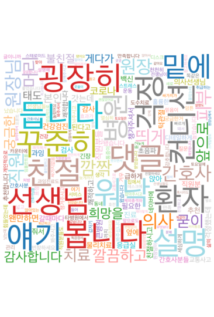

# 🏥 병원 리뷰 자동 분류 프로젝트  
Kakao Map 리뷰 기반 8-클래스 한국어 문장 분류 모델 개발

---

## 1. 프로젝트 개요
본 프로젝트는 카카오 지도에서 수집한 병원 리뷰 데이터를 기반으로  
리뷰 문장을 8개 카테고리로 자동 분류하는 AI 모델(KoELECTRA)을 개발하는 것을 목표로 한다.

---

## 2. 데이터 수집
### 2.1 데이터 출처
- Kakao Map 병원 1,300곳 리뷰 크롤링
- 총 리뷰 개수: **약 24,000개**


## 2.2 크롤링 상세 과정

Kakao Map은 리뷰를 HTML에서 직접 제공하지 않고  
비동기 JSON API로 리뷰 데이터를 내려보내기 때문에,  
**Puppeteer를 이용한 브라우저 자동 조작 + XHR(JSON) 요청 가로채기 방식**으로 크롤링을 진행하였다.

###  단계별 크롤링 구조

#### **1) Place ID 확보**
- 병원명으로 검색 → 자동완성 리스트 분석  
- 해당 병원 상세 페이지로 이동  
- URL에서 place_id 추출  
  예시: `https://place.map.kakao.com/705827517`

#### **2) 리뷰 탭 접근**
- Puppeteer에서 `"후기"` 탭을 클릭  
- 일부 병원은 HTML 요소가 늦게 로딩되어 클릭 실패 발생  
- 따라서 HTML 방식 + JSON 방식 병행

#### **3) JSON API 감지 (핵심)**
- KakaoMap은 다음과 같은 XHR 요청으로 리뷰를 제공한다:
- - Puppeteer에서 `page.on('response')` 이벤트를 이용해  
JSON 요청을 실시간 가로채고 응답 Body를 저장

#### **4) 모든 페이지 리뷰 수집**
- page=1,2,3… 증가시키며 모든 리뷰 수집  


#### **5) 최종 리뷰 데이터 구조**
```json
{
"place_id": "705827517",
"review_id": "RVE12345",
"rating": 5,
"date": "2024-01-10",
"content": "친절하고 설명을 잘해주셨습니다."
}
```
---

## 3. 데이터 전처리

###  3.1 텍스트 정제
제거한 패턴:

- HTML 태그  
- 이모지  
- 반복 문자  
- URL  
- 의미 없는 기호  

###  3.2 짧은 문장 제거
- 의미 없는 3자 이하 문장 제거  
- 예: "굿", "별로임", "okay"

---

## 4. 라벨 정의와 라벨링
### 4.1 제로샷 기반 초기 라벨링 (Zero-shot Classification)

대량의 리뷰 데이터를 사람이 직접 한계가 있기 때문에 초기 라벨링 단계에서는  
**HuggingFace의 Zero-shot Classification 모델**을 활용하여  
임시 라벨을 자동으로 생성하였다. 이 과정은 이후 정제 및 재라벨링의 기반이 되었다.

---

###  사용 모델
- **joeddav/xlm-roberta-large-xnli**
- 한국어 포함 다국어 NLI(Natural Language Inference) 기반
- 문장을 입력하면 여러 후보 라벨 중 가장 논리적으로 맞는 라벨을 선택하는 방식

---

###  라벨 후보 (8개 클래스)

Zero-shot 모델에 다음 8개 카테고리를 candidate로 제공하여 분류 수행:

| 번호 | 라벨명 |
|------|--------|
| 0 | 직원 태도 및 친절도 |
| 1 | 진료 및 설명 |
| 2 | 대기 시간 |
| 3 | 시설 및 환경 |
| 4 | 가격 및 비용 |
| 5 | 효과 및 결과 |
| 6 | 기타 긍정 |
| 7 | 기타 부정 |

---

### ✔ 제로샷 라벨링 방식

입력 문장:  
> “설명을 너무 잘해주시고 친절했어요.”

모델 출력 예시:

| 예측 라벨 | Confidence |
|----------|------------|
| 직원 태도 및 친절도 | 0.82 |

Zero-shot 모델은 문장 의미에 가장 적합한 라벨을 선택하고  
해당 라벨의 신뢰도(Confidence)를 함께 제공한다.

---

### ✔ 제로샷 라벨링의 활용 목적

- 대량 리뷰를 **초기 자동 라벨링**하여 인력 비용 절감  
- 잘못된 라벨은 사람이 검토해 수정
- 이후 Fine-tuned KoELECTRA 모델을 이용한 **Label Verification** 단계에서  
  재검증하여 불량 라벨을 추가 제거  
- 결과적으로 **데이터 품질을 크게 향상**

---

### ✔ 제로샷 라벨링의 한계

- 클래스 간 의미가 유사하면 혼동 발생  
- 짧은 문장이나 정보 부족 문장에서는 Confidence가 낮아짐  
- 일부 카테고리(가격·대기시간 등)는 다양한 표현 방식 때문에 예측 난이도 존재  

→ 따라서 Zero-shot 결과는 “초안 라벨”로만 사용하고,  
   이후 **사람 검수 + 모델 재검증**을 통해 최종 라벨 품질을 확보하였다.


---

## 5. 라벨 오류 자동 검출 (Label Verification System)

데이터 라벨 품질 개선을 위해  
 KoELECTRA 모델을 사용하여 라벨 오류가 의심되는 문장을 자동 추출했다.

### ✔ 의심 판정 기준
1) 모델 예측 라벨과 실제 라벨 불일치  
2) Confidence < 0.45  
3) 문장 길이 6자 이하  

### ✔ 결과
- 의심 문장 발견: **4,758개**
- 사람 검토 후 **219개 삭제**
- 전체 데이터 품질 향상

---

## 6. 데이터셋 구성

Stratified Split 적용(라벨 비율 유지).

| 구분 | 개수 | 비율 |
|------|------|-------|
| Train | 약 17,000 | 70% |
| Validation | 약 2,300 | 10% |
| Test | 약 4,000 | 20% |

---

## 7. 모델 구성

### ✔ 모델
- **KoELECTRA Base v3**

### ✔ 학습 설정
- Epoch: 10 
- Batch size: 32  
- Optimizer: AdamW  
- Learning Rate: 3e-5  
- Loss: CrossEntropy  

---

## 8. 학습 결과

### 8.1 Training / Validation Accuracy (Epoch별)

| Epoch | Train Accuracy | Valid Accuracy |
|-------|----------------|----------------|
| 1     | — | — |
| 3     | — | — |
| 5     | — | — |
| 7     | — | — |
| 10    | — | — |


### 8.2 Training / Validation Loss (Epoch별)

| Epoch | Train Loss | Valid Loss |
|-------|------------|-------------|
| 1     | — | — |
| 3     | — | — |
| 5     | — | — |
| 7     | — | — |
| 10    | — | — |


---

### ✔ 8.3 Confusion Matrix


Confusion Matrix 해석:

- '친절도', '진료 및 설명', '기타 긍정' 분류 성능 우수  
- '대기 시간', '가격', '시설' 카테고리는 서로 혼동되는 경우 존재  
- '기타 부정'은 표현 다양성으로 인해 일부 오차 발생  

---

### ✔ 8.4 Classification Report (F1-score)

| 라벨 | Precision | Recall    | F1-score | Support |
|------|-----------|-----------|----------|---------|
| 직원 태도 및 친절도 | 0.87      | 0.93      | 0.90     | 487     |
| 진료 및 설명 | 0.69      | 0.71      | 0.70     | 318     |
| 대기 시간 | 0.87      | 0.71      | 0.78     | 96      |
| 시설 및 환경 | 0.66      | 0.78      | 0.72     | 144     |
| 가격 및 비용 | 0.88      | 0.85      | 0.87     | 121     |
| 효과 및 결과 | 0.79      | 0.67      | 0.72     | 168     |
| 기타 긍정 | 0.83      | 0.73      | 0.77     | 420     |
| 기타 부정 | 0.60      | 0.74      | 0.66     | 144     |
| **Macro Avg** | **0.78**  | **0.76**  | **0.77** | 1898    |
| **Weighted Avg** | **0.79**  | **0.789** | **0.78** | 1898    |

---

## 9. 테스트 결과 (최종 평가)

- **Test Accuracy:** 78.35%  
- **Macro F1-score:** 0.77  
- **Weighted F1-score:** 0.78 

### ✔ 종합 해석
- 클래스 불균형이 있음에도 Macro F1 기준으로 안정적 성능 확보  
- 텍스트 표현이 다양한 클래스(기타 부정 등)에서 일부 오차  
- KoELECTRA Base 기준으로 준수한 문장 분류 성능 달성  

---
## 10. 토픽 모델링 분석 (Topic Modeling)

리뷰 데이터를 문장 단위로 분류하는 것 외에도,  
데이터 전체의 핵심 패턴을 파악하기 위해  
형태소 기반 전처리 후 WordCloud 시각화를 진행하였다.

아래 WordCloud는 불용어·조사·접속사 등을 제거하고  
의미 있는 핵심 단어만 남긴 뒤 생성한 결과이다.



### 10.1 WordCloud 주요 해석

- **친절 / 설명 / 선생님 / 간호사 / 환자**  
  → 의료진 친절도와 설명 만족도가 리뷰의 핵심 요소임을 반영

- **통증 / 치료 / 효과 / 검사**  
  → 시술 효과, 통증 개선, 검사 과정에 대한 언급이 많음

- **시설 / 깔끔 / 청결**  
  → 병원의 환경·위생 상태가 이용자 만족도에 중요한 요소

- **가격 / 과잉진료 / 비용**  
  → 비용 및 결제 관련 이슈도 일정 비중 존재

### 10.2 종합 요약
토픽 기반 시각화를 통해 병원 리뷰는 크게  
1) 의료진 친절,  
2) 설명 만족도,  
3) 치료 효과,  
4) 시설·위생,  
5) 가격 및 비용  
등의 주제로 구성됨을 확인하였다.

이는 모델이 분류한 8개 라벨과도 자연스럽게 일치하여  
전체 리뷰의 맥락을 잘 반영하는 시각적 근거가 된다.
---
## 11. 활용 방안

### ✔ 병원 리뷰 자동 분류 서비스
- 리뷰를 자동으로 8개 라벨로 구조화  
- 병원별 긍정·부정 요인 자동 분석

### ✔ 병원 비교분석 리포트 자동 생성
- 긍정률/부정률  
- 불만 요인 TOP3  
- 병원 간 통계 비교

---

## 12. 한계 및 개선점

- 리뷰 자체의 편향  
- 문장 단위 분리로 맥락 손실 존재  
- 특정 라벨 데이터 부족  
- RoBERTa, ELECTRA-large 등 대형 모델로 확장 가능  
- 문장 수준 → 문서 수준 분석으로 고도화 가능  

---

## 13. 결론

본 프로젝트는 실제 병원 리뷰 데이터를 기반으로  
KoELECTRA 모델을 fine-tuning하여 **8-클래스 한국어 문장 분류기**를 성공적으로 구축하였다.

크롤링 → 전처리 → 라벨 검증 → 학습 → 평가까지  
전 과정을 모두 자동화하여 병원 리뷰 분석 서비스로 확장 가능성이 높다.

---

## 📌 첨부 파일
- 학습 코드  
- 모델 파라미터  
- Confusion Matrix 이미지  
- 학습 곡선 그래프  
- 라벨 통계 그래프  
