# 병원 리뷰 자동 분류 프로젝트  
Kakao Map 리뷰 기반 8-클래스 한국어 문장 분류 모델 개발

---


## 1. 프로젝트 개요 및 배경

병원을 선택할 때마다 리뷰를 하나하나 읽어보는 것이 불편하다는 생각을 늘 가지고 있었다.  
‘친절했는지’, ‘설명을 잘 해줬는지’, ‘대기 시간이 얼마나 길었는지’ 같은 핵심 정보만 빠르게 알고 싶은데  
리뷰는 보통 길고 감정적인 내용이 많아 원하는 정보를 찾기 어려웠다.

이 문제를 해결할 수 있다면  
나뿐만 아니라 많은 사람들이 병원을 선택하는 데 도움을 받을 수 있을 것이라는 생각이 들었다.  
또한 수업에서 배운 텍스트 분류, 전처리, 딥러닝 모델링을  
실제 생활 속 문제에 직접 적용해보고 싶은 마음도 컸다.

그래서 본 프로젝트에서는  
Kakao Map에서 수집한 병원 리뷰를 기반으로  
**사용자가 원하는 정보(친절·설명·가격·효과 등)를 자동으로 추출할 수 있는  
한국어 문장 분류 모델을 만드는 것**을 목표로 삼았다.

이 과정은 단순한 감성 분석이 아니라,  
리뷰 속 숨겨진 “정보 단위”를 찾아내는 새로운 구조화(Task)였다.  
이를 위해  
**크롤링 → 전처리 → Zero-shot 초기 라벨링 → 라벨 검증 모델 → 학습 → 평가 → 라벨 기반 토픽 분석**  
까지 모든 단계를 직접 설계하며 진행했다.

---

## 2. 데이터 수집
### 2.1 데이터 출처
- Kakao Map 병원 1,300곳 리뷰 크롤링
- 총 리뷰 개수: **약 24,000개**


### 2.2 크롤링 상세 과정

Kakao Map은 리뷰를 HTML로 제공하지 않고  
비동기 JSON API 형태로 데이터를 내려주는 구조였다.  
즉, 일반적인 HTML 파싱 방식으로는 리뷰 수집이 불가능했다.

이를 해결하기 위해 **Puppeteer 브라우저 자동화 + XHR(JSON) 가로채기 방식**으로 크롤링을 수행했다.


###  단계별 크롤링 구조

#### **1) Place ID 확보**
- 병원명으로 검색 → 자동완성 리스트 분석  
- 해당 병원 상세 페이지로 이동  
- URL에서 place_id 추출  
  예시: `https://place.map.kakao.com/705827517`

#### **2) 리뷰 탭 접근**
- Puppeteer에서 `"후기"` 탭을 클릭  
- 일부 병원은 HTML 요소가 늦게 로딩되어 클릭 실패 발생  
- 따라서 HTML 방식 + JSON 방식 병행

#### **3) JSON API 감지 (핵심)**
- KakaoMap은 다음과 같은 XHR 요청으로 리뷰를 제공한다:
- - Puppeteer에서 `page.on('response')` 이벤트를 이용해  
JSON 요청을 실시간 가로채고 응답 Body를 저장

#### **4) 모든 페이지 리뷰 수집**
- page=1,2,3… 증가시키며 모든 리뷰 수집  


#### **5) 최종 리뷰 데이터 구조**
```json
{
"place_id": "705827517",
"review_id": "RVE12345",
"rating": 5,
"date": "2024-01-10",
"content": "친절하고 설명을 잘해주셨습니다."
}
```

---
## 2.2 전국 병원 분포 시각화

카카오맵에서 수집된 1,300개 병원이 실제로 전국에 어떻게 분포되어 있는지 확인하기 위해
광역시도 단위의 병원 수를 활용하여 Choropleth(단계구분도) 를 제작하였다.


경기도, 서울특별시 → 병원 수가 가장 많아 짙은 색으로 표시됨

부산, 경남, 대구 → 중간 수준의 의료기관 밀집

지방 강원·전북·전남·제주 → 상대적으로 병원 밀도가 낮아 밝은 색

세종 → 병원 수 0으로 가장 연한 색

---
## 3. 데이터 전처리

###  3.1 텍스트 정제
제거한 패턴:

- HTML 태그  
- 이모지  
- 반복 문자  
- URL  
- 의미 없는 기호  

###  3.2 짧은 문장 제거
- 의미 없는 3자 이하 문장 제거  
- 예: "굿", "별로임", "okay"

### 3.3 문장 길이 분포  
- 리뷰 문장은 평균 18자  
- 대부분 10~30자에 분포  
- 3자 이하 무의미 문장은 제거하여 품질 향상

---

## 4. 라벨 정의와 라벨링
### 4.1 제로샷 기반 초기 라벨링 (Zero-shot Classification)


24,000개 이상의 리뷰 데이터를 문장 단위로 분리한 후, 이를 사람이 직접 라벨링하는 것은 현실적으로 어려운 작업이었다.  
이에 따라 초기 단계에서는 **HuggingFace Zero-shot Classification 모델**을 활용하여 문장별 임시 라벨을 자동으로 생성하였다.  
이 자동 라벨은 이후 정제 및 재라벨링 작업의 출발점 역할을 수행했다.

---

###  사용 모델
- **joeddav/xlm-roberta-large-xnli**
  - 한국어 포함 다국어 NLI(Natural Language Inference) 기반
  - 문장을 입력하면 여러 후보 라벨 중 가장 논리적으로 맞는 라벨을 선택하는 방식

---

###  라벨 후보 (8개 클래스)

Zero-shot 모델에 다음 8개 카테고리를 candidate로 제공하여 분류 수행:

| 번호 | 라벨명 |
|------|--------|
| 0 | 직원 태도 및 친절도 |
| 1 | 진료 및 설명 |
| 2 | 대기 시간 |
| 3 | 시설 및 환경 |
| 4 | 가격 및 비용 |
| 5 | 효과 및 결과 |
| 6 | 기타 긍정 |
| 7 | 기타 부정 |

---

###  제로샷 라벨링 방식

입력 문장:  
> “설명을 너무 잘해주시고 친절했어요.”

모델 출력 예시:

| 예측 라벨 | Confidence |
|----------|------------|
| 직원 태도 및 친절도 | 0.82 |

Zero-shot 모델은 문장 의미에 가장 적합한 라벨을 선택하고  
해당 라벨의 신뢰도(Confidence)를 함께 제공한다.

---

###  제로샷 라벨링의 활용 목적

- 대규모 리뷰 데이터에 대한 **초기 라벨링 자동화**  
  - 수작업 라벨링 시간 및 비용 절감  
  - 이후 진행되는 **라벨 정제(Label Verification)**의 기반 데이터 생성  
  - 학습 데이터 품질을 단계적으로 향상시키기 위한 전처리 역할

---

###  제로샷 라벨링의 한계

초기 자동 라벨링만으로는 다음과 같은 문제점이 확인되었다:

- 의미가 유사한 카테고리(예: 시설·가격, 친절도·설명) 간 혼동  
  - 정보가 부족한 짧은 문장의 낮은 Confidence  
  - 가격/대기시간처럼 표현 방식이 다양해 정밀한 분류가 어려운 경우 존재  

이러한 한계로 인해 Zero-shot 결과는 **임시 라벨(Pre-label)**로만 활용되었고,  
에러 검출 모델과 사람이 함께 검증하는 추가 단계가 필요했다.


---

## 5. 라벨 오류 자동 검출 (Label Verification System)

Zero-shot 초기 라벨에는 품질 편차가 존재했기 때문에,  
최종 학습 데이터셋을 구성하기 전 **KoELECTRA 기반 라벨 검증 모델**을 구축해  
자동으로 라벨 오류를 탐지하는 절차를 추가하였다.

###  의심 판정 기준
다음 기준 중 하나 이상에 해당할 경우 “오류 가능성 있음”으로 분류하였다:
1) 모델 예측 라벨과 실제 라벨 불일치  
   2) Confidence < 0.45  
   3) 문장 길이 6자 이하  

###  검증 결과
| 항목 | 개수 |
|------|------|
| 자동 의심 문장 | **4,758개** |
| 사람 검토 후 실제 오류 | **219개** |
| 최종 개선 효과 | 라벨 품질 안정화 |

Zero-shot 라벨링과 검증 모델을 함께 적용함으로써  
대규모 리뷰 라벨링 과정의 신뢰도와 효율을 모두 확보할 수 있었다.
---

## 6. 데이터셋 구성

Stratified Split 적용(라벨 비율 유지).

| 구분 | 개수 | 비율 |
|------|------|-------|
| Train | 약 17,000 | 70% |
| Validation | 약 2,300 | 10% |
| Test | 약 4,000 | 20% |

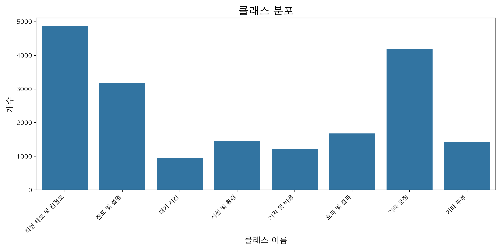

라벨 분포는 다음과 같은 특징을 가진다:
- ‘친절도’, ‘진료 설명’, ‘기타 긍정’ 데이터가 상대적으로 많다.
- ‘대기 시간’, ‘시설’, ‘가격’ 데이터는 비교적 적어 불균형이 존재한다.
- 이런 불균형은 이후 모델 성능에 영향을 주었으며, 이는 한계 및 개선점에서 추가로 논의하였다.
---

## 7. 모델 구성

### 모델
- **KoELECTRA Base v3**

###  학습 설정
- Epoch: 10 
- Batch size: 32  
- Optimizer: AdamW  
- Learning Rate: 3e-5  
- Loss: CrossEntropy  

---

## 8. 학습 결과

### 8.1 Training / Validation Accuracy, Train Loss (Epoch별)

| Epoch | Train Accuracy | Valid Accuracy | Train Loss |
|-------|--------|----------------|---------|
| 1     | 0.8172 | 0.7387         | 1.1628  |
| 3     |  0.9403       | 0.7587         | 0.3456  |
| 5     |     0.9792   | 0.7719         | 0.1205  |
| 7     | 0.9926       | 0.7824         | 0.0636  |
| 10    | 0.9972       | 0.7835         | 0.0419        |


|     **accuracy_curve**      |    **Loss_curve**     |
|:---------------------------:|:---------------------:|
| 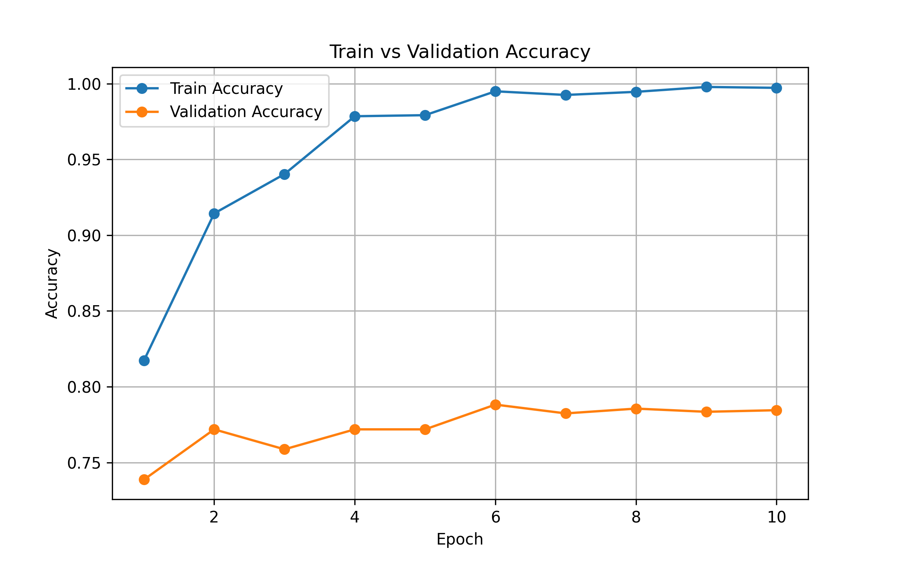 | 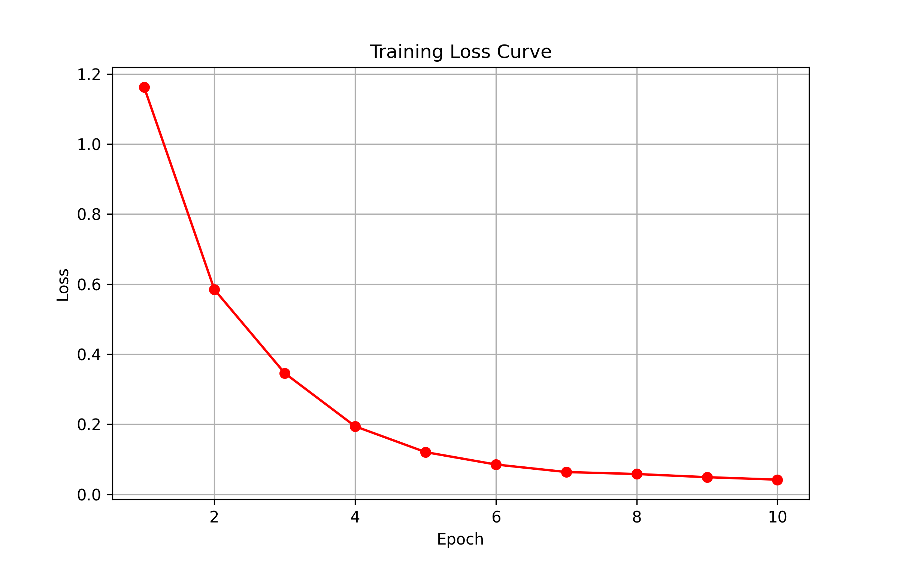 |


---

###  8.3 Confusion Matrix


Confusion Matrix 해석:

- '친절도', '진료 및 설명', '기타 긍정' 분류 성능 우수  
- '대기 시간', '가격', '시설' 카테고리는 서로 혼동되는 경우 존재  
- '기타 부정'은 표현 다양성으로 인해 일부 오차 발생  

---

###  8.4 Classification Report (F1-score)

| 라벨 | Precision | Recall    | F1-score | Support |
|------|-----------|-----------|----------|---------|
| 직원 태도 및 친절도 | 0.87      | 0.93      | 0.90     | 487     |
| 진료 및 설명 | 0.69      | 0.71      | 0.70     | 318     |
| 대기 시간 | 0.87      | 0.71      | 0.78     | 96      |
| 시설 및 환경 | 0.66      | 0.78      | 0.72     | 144     |
| 가격 및 비용 | 0.88      | 0.85      | 0.87     | 121     |
| 효과 및 결과 | 0.79      | 0.67      | 0.72     | 168     |
| 기타 긍정 | 0.83      | 0.73      | 0.77     | 420     |
| 기타 부정 | 0.60      | 0.74      | 0.66     | 144     |
| **Macro Avg** | **0.78**  | **0.76**  | **0.77** | 1898    |
| **Weighted Avg** | **0.79**  | **0.789** | **0.78** | 1898    |

---

## 9. 테스트 결과 (최종 평가)

- **Test Accuracy:** 78.35%  
- **Macro F1-score:** 0.77  
- **Weighted F1-score:** 0.78 

### 종합 해석
- 클래스 불균형이 있음에도 Macro F1 기준으로 안정적 성능 확보  
- 텍스트 표현이 다양한 클래스(기타 부정 등)에서 일부 오차  
- KoELECTRA Base 기준으로 준수한 문장 분류 성능 달성  

---
## 10. 라벨별 토픽 분석 (Label-wise Topic Interpretation)

본 연구에서는 모델이 예측한 8개 라벨별로 리뷰 문장을 분리한 후,  
각 라벨에서 자주 등장하는 핵심 단어를 WordCloud로 시각화하였다.  

아래 WordCloud는 불용어·조사·접속사 등을 제거하고  
의미 있는 핵심 단어만 남긴 뒤 생성한 결과이다.

## 10. 라벨별 WordCloud 시각화 

| **직원 태도 및 친절도** | **진료 및 설명** | **대기 시간** | **시설 및 환경** |
|:------------------------:|:------------------:|:----------------:|:------------------:|
| 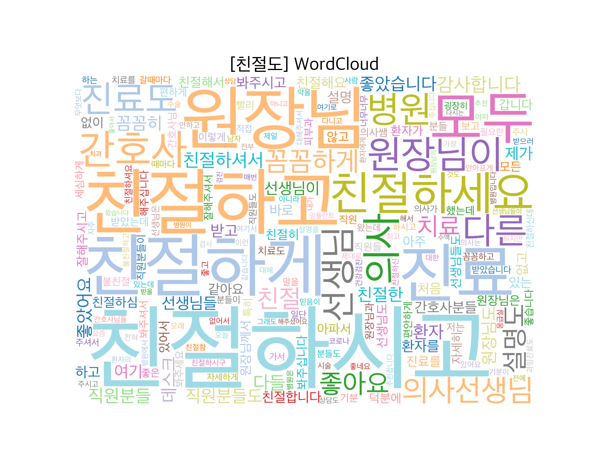 | 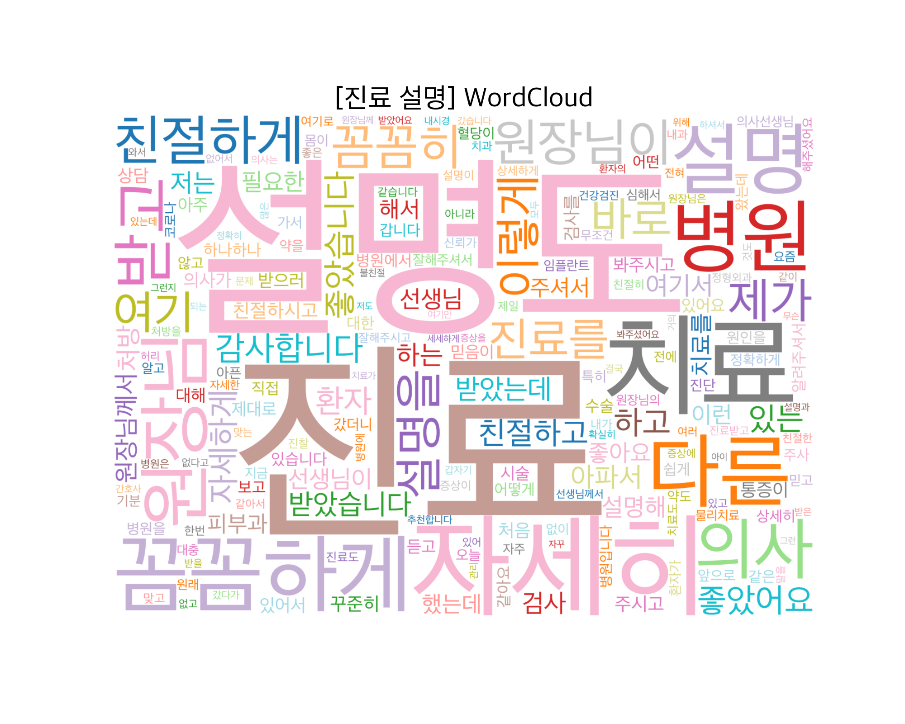 | 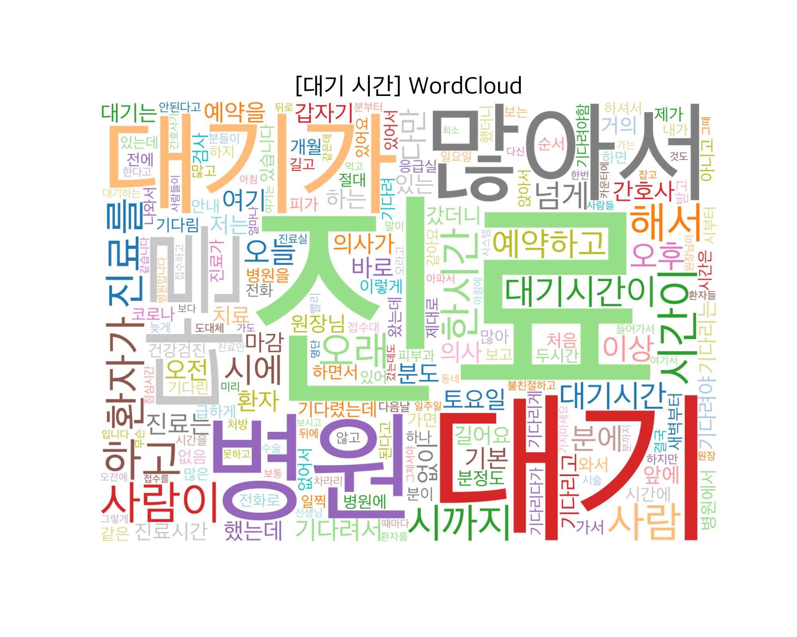 | 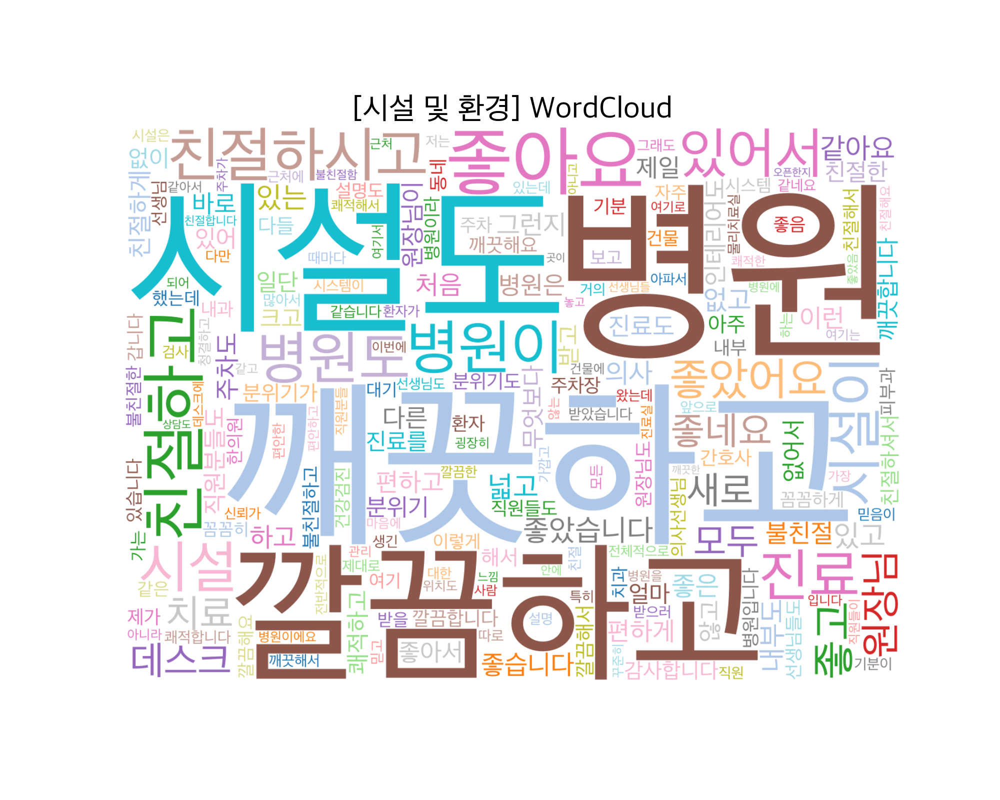 |

| **가격 및 비용** | **효과 및 결과** | **기타 긍정** | **기타 부정** |
|:------------------:|:------------------:|:----------------:|:----------------:|
| 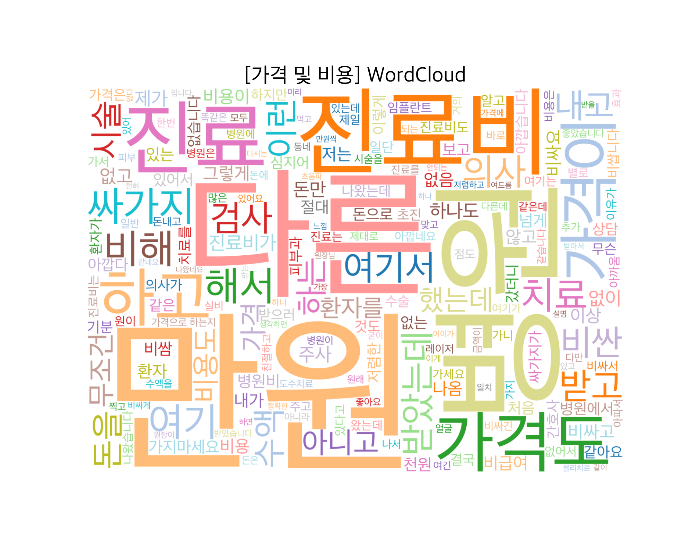 | 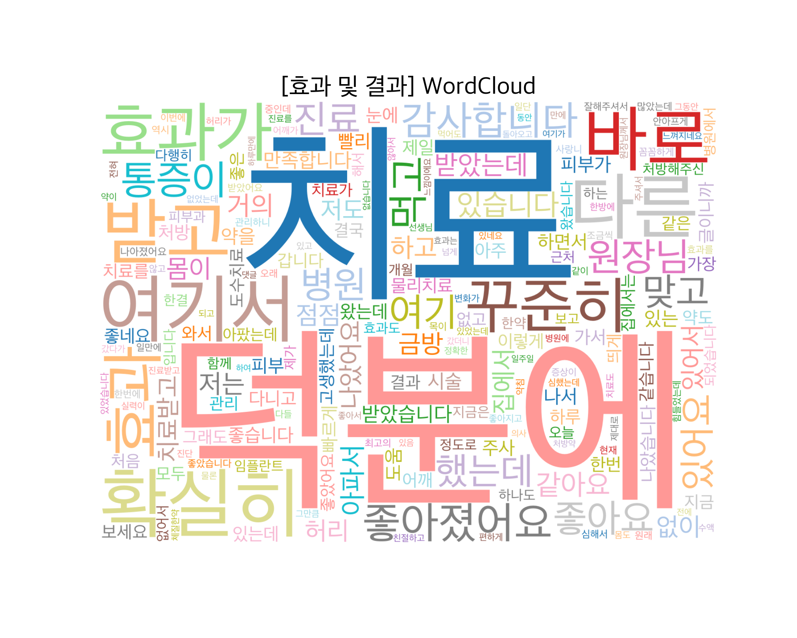 | 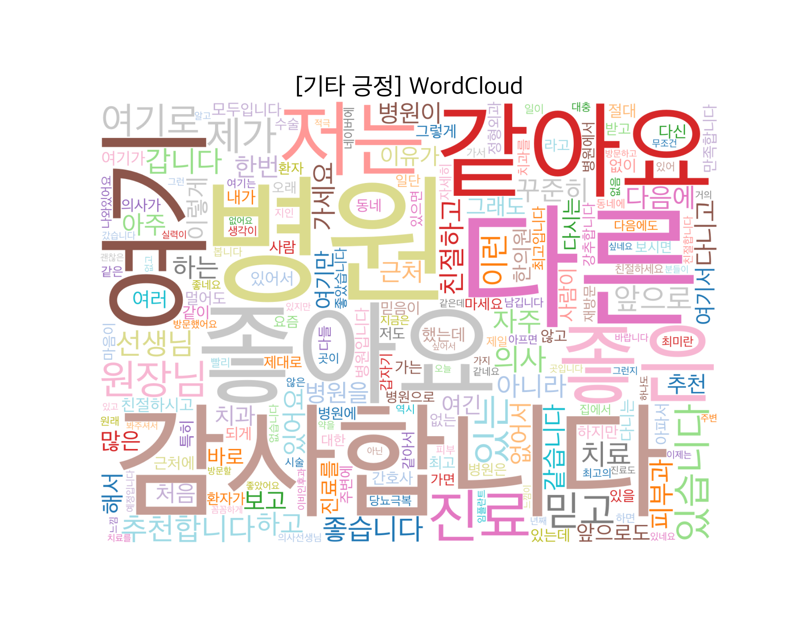 | 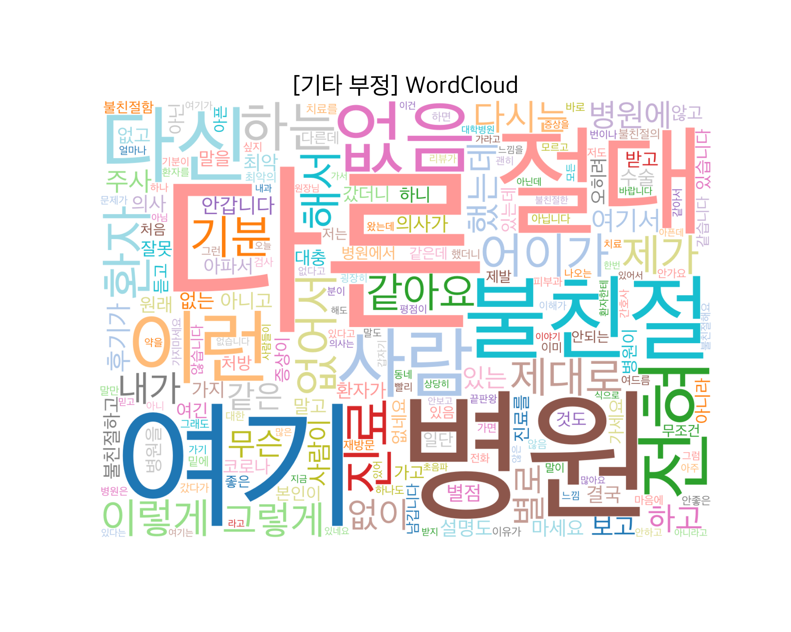 |


### 10.1 WordCloud 주요 해석

- **친절 / 설명 / 선생님 / 간호사 / 환자**  
  → 의료진 친절도와 설명 만족도가 리뷰의 핵심 요소임을 반영

- **통증 / 치료 / 효과 / 검사**  
  → 시술 효과, 통증 개선, 검사 과정에 대한 언급이 많음

- **시설 / 깔끔 / 청결**  
  → 병원의 환경·위생 상태가 이용자 만족도에 중요한 요소

- **가격 / 과잉진료 / 비용**  
  → 비용 및 결제 관련 이슈도 일정 비중 존재

### 10.2 종합 요약
토픽 기반 시각화를 통해 병원 리뷰는 크게  
1) 의료진 친절,  
2) 설명 만족도,  
3) 치료 효과,  
4) 시설·위생,  
5) 가격 및 비용  
등의 주제로 구성됨을 확인하였다.

이는 모델이 분류한 8개 라벨과도 자연스럽게 일치하여  
전체 리뷰의 맥락을 잘 반영하는 시각적 근거가 된다.
---

## 11. 한계 및 개선점

본 프로젝트는 병원 리뷰를 8개 카테고리로 효과적으로 분류했지만, 다음과 같은 제한점이 있었다.

### 1) 특정 클래스 데이터 부족  
‘대기 시간’, ‘시설’, ‘가격’ 등 일부 카테고리는 리뷰 자체가 적어 학습 데이터가 충분하지 않았다.  
이로 인해 해당 클래스의 분류 성능이 상대적으로 낮아지는 문제가 있었다.

**개선 방향:** 데이터 추가 수집 및 불균형 데이터 처리 기법 적용

---

### 2) 리뷰 표현의 다양성  
한국어 리뷰에는 줄임말, 오탈자, 비표준 표현이 매우 많아  
모델이 문장의 정확한 의미를 해석하는 데 어려움이 있었다.

**개선 방향:** 오탈자 정제 규칙 및 사용자 정의 사전 강화

---

### 3) Zero-shot 라벨링의 혼동  
Zero-shot 모델은 초기 라벨링에는 유용했지만,  
의미가 유사한 클래스 간에는 정확도가 떨어지는 한계가 있었다.

**개선 방향:** Few-shot 기반 라벨 보정 또는 다중 검증 구조 강화


---

## 12. 결론


본 프로젝트는 Kakao Map에서 수집한 병원 리뷰 데이터를 기반으로,  
문장 내 정보를 8개 주제(친절·설명·대기시간·시설·가격·효과·긍정·부정)로 자동 분류하는  
한국어 문장 분류 모델을 구축한 작업이었다.

크롤링, 전처리, Zero-shot 기반 초기 라벨링, KoELECTRA 검증 모델을 통한 라벨 정제,  
최종 모델 학습까지 전체 파이프라인을 직접 설계함으로써  
대규모 리뷰 데이터를 구조적인 형태로 변환할 수 있는 시스템을 구현했다.

최종 모델은 **Accuracy 78.35%**, **Macro F1-score 0.77**을 기록하며,  
병원 리뷰에서 핵심 정보를 자동으로 추출하는 데 실용적인 성능을 보였다.  
또한 WordCloud 기반 토픽 분석을 통해 리뷰 전반에서  
친절도, 설명 만족, 시설·위생, 비용, 치료 효과 등의 주제가 주요하게 나타난다는 점도 확인하였다.

본 연구는 병원 리뷰와 같은 비정형 텍스트를  
사용자 관점에서 의미 있는 정보 단위로 재구조화할 수 있다는 가능성을 보여주었다는 점에서 의미가 크다.  
향후에는 문서 단위 분류, 세분화된 라벨 기준 추가, 데이터 편향 개선 등을 통해  
병원 선택 지원 서비스나 리뷰 자동 요약 시스템으로의 확장 가능성도 기대된다.


---
